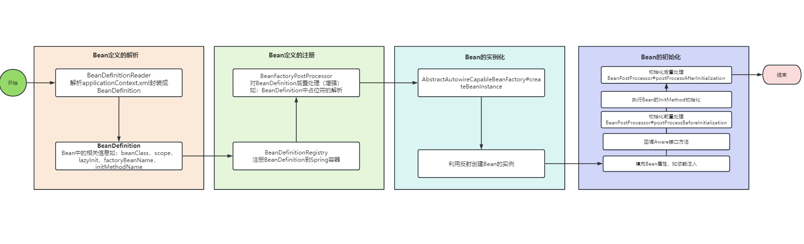

# Spring 容器 IOC

Spring框架是Spring生态中的基石，后续的Spring-boot Spring Cloud 等框架都是基于Spring中的提供的各种扩展点扩展而来，所以了解Spring框架显得尤为重要，通过Spring源码，我们可以深刻体会到什么叫开闭原则，什么叫扩展性。

## Spring中主要的核心接口如下：

- BeanFactory：Spring 容器的顶层接口，定义了获取Bean的规范。
- ApplicationContext：Spring容器上下文，主要体现了Spring容器的中Bean的生命周期。
- Environment: 在容器启动前读取一些环境变量信息。
- BeanDefinition: 封装Bean的信息，如beanClass，Scope，LazyInit，factoryBeanName等。

- BeanDefinitionReader: 负责从配置文件解析BeanDefinition。
- BeanDefinitionRegistry: 负责向Spring容器注册BeanDefinition。
- BeanFactoryPostProcessor：实现对BeanDefinition的后置处理（增强），典型的PlaceholderConfigurerSupport用于解析bean定义配置文件中的占位符。
- FactoryBean: 就是单个对象的工厂类，和普通的Bean不一样，该工厂类所持有的对象引用应该是`getObject()`方法实际创建并返回的Bean而不是它本身，主要是提供给用户自定义实例化Bean的扩展点。
- BeanPostProcessor: Bean实例的后置处理，如实现AOP增强
- Aware: 类似于一个标记接口，如果一个Bean实现了XXXAware接口，Spring容器实例化Bean之后会采用callback的方式进行回调，通常作用是获取Spring容器的一些内置对象（Environment,ApplicationContext,BeaFactory），比如实现了ApplicationContextAware，Bean实例化之后就会通过setApplicationContext传入容器对象

## Spring中Bean的生命周期

Spring中Bean的生命周期从宏观上看其实主要分为四步：

**Bean定义信息的解析 —>Bean定义信息的注册—>Bean 的实例化 —>Bean的初始化**



## Spring容器启动

Spring 容器启动整体流程都在AbstractApplicationContext#refresh()方法中，主要流程如下：

- prepareRefresh(): 容器刷新的准备工作，设置Spring 容器的开启状态标志，实例化StandardEnvironment对象，初始化 早期的ApplicationListener(这是一个扩展点，比如Spring boot 会在这个点注册一些监听器)
- obtainFreshBeanFactory: 实例化DefaultListableBeanFactory，ResourceLoader读取xml配置文件，并通过BeanDefinitionReader解析成BeanDefinition装在到Spring容器。
- prepareBeanFactory: 对BeanFactory做一些初始化工作，如设置ClassLoader,添加预制的BeanPostProcessor，注册Environment对象到Spring容器。
- postProcessBeanFactory: 钩子函数，交由子类扩展实现，比如在SpringMVC中对BeanFactory做一些前置处理。
- invokeBeanFactoryPostProcessors: 实例化并按顺序（PriorityOrdered优先，其次是Ordered，最后是没有实现排序接口的）执行BeanFactoryPostProcessor，对初步解析的BeanDefinition做一些增强，比如解析占位符。
- registerBeanPostProcessors: 实例化并注册Bean初始化过程中的所需要的BeanPostProcessor。
- initMessageSource: 准备国际化的资源
- initApplicationEventMulticaster: 初始化事件的广播器
- onRefresh: 钩子函数，扩展点
- registerListeners: 注册监听器
- finishBeanFactoryInitlization: 实例化所有的单例对象（Bean实例化，初始化核心流程）
- finishRefresh：容器刷新完毕做一些收尾工作，比如发布容器刷新完毕事件ContextRefreshedEvent


ApplicationContext是Spring容器的上下文，可以理解为要想启动Spring容器，就必须实例化出一个具体的ApplicationContext的实现类，通常有两种：

- ClassPathXmlApplicationContext: 基于xml文件配置的
- AnnotationConfigApplicationContext: 基于Java注解形式配置的

### 1. Spring容器加载并解析配置文件

1. 读取系统环境变量并加载到PropertySource中，因为对于配置文件名上有占位符${}时，需要进行替换，在ClassPathXmlApplicationContext构造方法中，setConfigLocations中创建StandardEnvironment，然后加载系统变量信息：

```java
	public ClassPathXmlApplicationContext(
			String[] configLocations, boolean refresh, @Nullable ApplicationContext parent)
			throws BeansException {

		super(parent);
    	// 设置配置文件
    	// AbstractRefreshableApplicationContext#setConfigLocations
		setConfigLocations(configLocations);
		if (refresh) {
			refresh();
		}
	}

```

2. AbstractRefreshableApplicationContext#setConfigLocations

   通过AbstractPropertyResolver创建出PropertyPlaceholderHelper，结合系统环境变量值对占位符进行解析得到最终的配置文件名

```java
	public void setConfigLocations(@Nullable String... locations) {
		if (locations != null) {
			Assert.noNullElements(locations, "Config locations must not be null");
			this.configLocations = new String[locations.length];
			for (int i = 0; i < locations.length; i++) {
				this.configLocations[i] = 
                    // 解析配置文件的路径
                    resolvePath(locations[i]).trim();
			}
		}
		else {
			this.configLocations = null;
		}
	}

	protected String resolvePath(String path) {
    // 1. 创建StandardEvironment，并在父类AbstractEnvironment构造中回调customizePropertySources
    // 读取System.getProperties()和System.getEnv()装载到Spring容器中的PropertySourceList中
    // 2. 通过resolveRequiredPlaceholders解析配置文件名上的${}占位符
		return getEnvironment().resolveRequiredPlaceholders(path);
	}
```

3. 创建BeanFactory并解析xml得到BeanDefinition注册到BeanFactory中

   在AbstractApplicationContext#obtainFreshBeanFactory中，首先实例化DefaultListableBeanFactory，接着实例化XmlBeanDefinitionReader并持有DefaultListableBeanFactory的引用，通过AbstractBeanDefinitionReader将文件读取并封装成Resource对象，利用SAX读取xml文件流并生成Document，通过解析Document中的每一个Node最终封装成BeanDefinition注册到BeanFactory。

#### 扩展点：自定义xml标签

1. 自定义标签的xsd文件
2. 自定义spring.schemas配置文件，用于将xml中的namespace和xsd做映射。
3. 自定义spring.handlers配置文件，用于指定自定义标签的handler实现类
4. 自定义NamespaceHandler，需继承NamespaceHandlerSupport
5. 自定义标签解析器，需继承于AbstractSingleBeanDefinitionParser，并重写getBeanClass（用于指定BeanDefinition的class）和doParse(Element element, BeanDefinitionBuilder builder) 用于解析每个属性值
6. 在自定义的NamepaceHandler的init方法中将标签属性和解析器BeanDefinitionParser一一映射

​	

### 2. 容器刷新前置准备

prepareRefresh()

#### 扩展点：initPropertySources()

可以重写该方法添加自定义的PropertySource

### 3. 创建BeanFactory实例

obtainFreshBeanFactory

1. 创建DefaultListableBeanFactory

### 4. 初始化BeanFactory

AbstractApplicationContext#prepareRefresh

1. 创建并设置SPEL表达式解析器，StandardBeanExpressionResolver
2. 创建并设置默认的属性编辑器，ResourceEditorRegistrar
3. 注册ApplicationContextAwareProcessor，该PostProcessor作用为initializeBean时，进行ApplicationContextAware的设置。
4. 配置依赖注入忽略的接口ignoreDependencyInterface，如ApplicationContextAware

#### 扩展点：自定义属性编辑器，PropertyEditor

​	a. 定义属性编辑器继承PropertyEditorSupport并重写setAsText(String text)，增加自定义属性设置逻辑。

​	b. 定义编辑器的注册器，实现PropertyEditorRegistrar接口，并实现registerCustomEditors(PropertyEditorRegistry registry)，在该方法中通过registry将属性类型和属性编辑器实例进行绑定。

​	c. 在xml配置文件中，将自定义的PropertyEditorRegistrar注册到CustomEditorConfigurer中

​	d. CustomEditorConfigurer实现了BeanFactoryPostProcessor接口，在invokeBeanFactoryPostprocessors中会执行postProcessBeanFactory，将自定义的EditorRegistrar添加到BeanFactory中

​	e. 在Bean实例化时并封装到BeanWrapper时，通过自定义EditorRegistrar注册属性编辑器PropertyEditor

​	f. 最终在Bean属性填充阶段会调用PropertyEditor的setAsText(String text)


### 5. BeanFactory后置处理postProcessBeanFactory

在BeanFactory初始化完成之后做一些后置处理，该方法为模板方法，默认是空实现，可交友子类进行重写扩展。

典型的实现，可以通过该方法中的beanFactory注册额外的BeanPostProcessor

```java
public class MyApplicationContext extends AnnotationConfigApplicationContext {

    public MyApplicationContext(Class<?>... annotatedClasses) {
        super(annotatedClasses);
    }

    @Override
    protected void postProcessBeanFactory(ConfigurableListableBeanFactory beanFactory) {
        System.out.println("手工注册BeanPostProcessor前的数量：" + beanFactory.getBeanPostProcessorCount());

        // 手工注册 BeanPostProcessor
        beanFactory.addBeanPostProcessor(new MyBeanPostProcessor());

        System.out.println("手工注册BeanPostProcessor前的数量：" + beanFactory.getBeanPostProcessorCount());
    }
}
```


### 6. 执行BeanFactoryPostProcessor

```
invokeBeanFactoryPostProcessors(beanFactory);
```

这一步是执行BeanFactory的后置处理器，主要分为两类：

- BeanDefinitionRegistryPostProcessor
- BeanFactoryPostProcessor 

BeanDefinitionRegistryPostProcessor是BeanFactoryPostProcessor 的子接口，BeanDefinitionRegistryPostProcessor主要作用是注册额外的BeanDefinition，而BeanFactoryPostProcessor 就是对已经注册的BeanDefinition做进一步的解析，比如常用的配置注解（@ComponentScan，@Import）就是通过ConfigurationClassPostProcessor进行解析，并注册更多的BeanDefinition到BeanFactory中。

两种后置处理器执行顺序不同：BeanDefinitionRegistryPostProcessor优先于BeanFactoryPostProcessor执行，并且分别还通过PriorityOrdered和Ordered进行优先级排序。


## 1. `FactoryBean`

- FactoryBean，就是单个对象的工厂类，和普通的Bean不一样，该工厂类所持有的对象引用应该是`getObject()`方法实际创建并返回的Bean而不是它本身。
尽管Spring容器在启动时会以普通Bean创建的方式一样去创建FactoryBean。

- FactoryBean支持单例和多例，根据`isSingleton()`返回值来确定是否是单例，默认为true。

- FactoryBean生成的Bean，支持懒加载或者在容器启动阶段就同步创建Bean，如果需要同步创建Bean则可以选择实现 `SmartFactoryBean`，
该接口继承`FactoryBean`并提供是否支持同步创建Bean的实例`SmartFactoryBean#isEagerInit()`。

源码解析见：[(手把手玩转Spring 之 FactoryBean)](https://blog.csdn.net/Ecilipse/article/details/105408920)

## 2. `InitializingBean`
在Spring容器创建Bean的时候，我们可以通过自定义的方式去给Bean实例化之后做一些初始化的操作：
1. 利用`@Bean(initMethod="init")`中指定 initMethod。
2. 实现`InitializingBean`接口。

```
@Configuration
public class InitializingBeanConfig {
    /**
     * 实现了 InitializingBean
     */
    @Bean(name = "myInitializingBean")
    public MyInitializingBean getMyInitializingBean() {
        return new MyInitializingBean();
    }
    /**
     * 自定义 initMethod 方法
     */
    @Bean(name = "myCustomInitializingBean", initMethod = "init", destroyMethod = "destroy")
    public MyCustomInitializingBean getMyCustomInitializingBean() {
        return new MyCustomInitializingBean();
    }
}
```

## 3. `ApplicationContextAware`
`ApplicationContextAware` 是Spring容器提供用于初始化Bean的一个入口，通常情况下我们所有的Bean的生命周期都是交给Spring容器去管理，
如实例化，初始化，销毁等。

根据官方文档介绍：
- 实现该接口之后，在容器启动时，BeanFactory 就是自动通知我们实现类去完成一系列操作。
- 实现该接口之后，我们可以在容器启动时，能够很便利的通过当前的`ApplicationContext`去获取到我们需要的Bean，Spring建议，如果是为了
设置类似于依赖Bean的话，Spring是不推荐实现该接口的，应该交给Spring去帮助我们加载依赖的Bean，如通过`@Autowired`的方式。
- Spring 还给我们提供了一个该接口的抽象实现类，其实我们可以直接继承该抽象实现类`ApplicationObjectSupport`，完成我们的想要的功能。

例如自定义我们的`ApplicationContextAware`:

```
@Component
public class MyApplicationContextAware implements ApplicationContextAware {

    private ApplicationContext applicationContext;

    @Override
    public void setApplicationContext(ApplicationContext applicationContext) throws BeansException {
        System.out.println("set my applicationContext !");
        this.applicationContext = applicationContext;

        // 自定义其他操作
        doSomethingMore();
    }

    /**
     * 只要持有了 {@link ApplicationContext} 我们就可以做一些其他的操作，
     * 如：通过 applicationContext.getBean() 获取到容器中的其他 Bean实例完成一系列的功能
     */
    protected void doSomethingMore() {
        Environment environment = this.applicationContext.getEnvironment();
        String osName = environment.getProperty("os.name");
        System.out.println("当前操作系统为:" + osName);
    }
}
```

在容器启动时就会执行`setApplicationContext`，然后执行`doSomethingMore`完成我们想扩展的功能。

源码解析见：[(手把手玩转Spring 之 ApplicationContextAware)](https://blog.csdn.net/Ecilipse/article/details/105437086)

## 4. `BeanPostProcessor`
Spring Bean 创建的拦截器

## 5. `BeanFactoryPostProcessor`
Spring Bean Factory 拦截器

